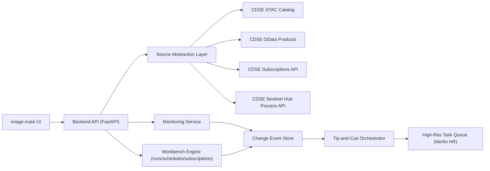

# Merlin Constellation Enhancement: Sentinel-2 Integration Design

## Document Control
- Status: Draft v0.1 (pre-implementation)
- Date: February 13, 2026
- Author: Codex + Mark (working draft)
- Scope: Integrate Sentinel-2 imagery from Copernicus into image-mate as a new logical source named `Merlin`, enabling repeat monitoring, change detection, and tip-and-cue to high-resolution tasking.

## Implementation Update (February 20, 2026)
- Sentinel-2 result selection in plugin now prioritizes geospatial assets first (`visual_fullres`, `visual`, `analytic`) before previews.
- Sentinel-2 WMTS stream path now prefers backend endpoint `/api/layers/sentinel/wmts` (configurable via plugin setting `image_mate/cdse/wmts_use_backend_proxy`, default `true`) and preserves per-item day `TIME` pinning.
- Sentinel-2 load fallback now attempts WMTS automatically when all raster asset downloads fail and reports attempted asset keys in error messages.
- Plugin and backend search paths now emit explicit source/collection/count logs for Sentinel-2 and other providers.
- Workbench arrival polling now propagates `source_id` and uses source-aware default collections (`merlin-s2` -> `CDSE_SENTINEL2_COLLECTIONS[0]` or `sentinel-2-l2a`; `satellogic` -> `l1d-sr`).
- Monitoring create flows now preserve selected source end-to-end and emit source/collection trace logs.

## 1. Problem Statement
The platform currently supports archive search and time-series workflows centered on existing high-resolution sources. We want to add a medium-resolution, high-revisit source that behaves like a new Merlin feed so users can:
- search historical imagery by AOI/time,
- monitor repeat captures over time,
- detect change events,
- trigger high-resolution point-target follow-up tasking (tip-and-cue).

## 2. Context and External Constraints
- Copernicus Open Access Hub has been decommissioned (November 13, 2023). New integration should target Copernicus Data Space Ecosystem (CDSE), not legacy Open Access Hub endpoints.
- Sentinel-2 is multispectral optical imagery with repeat coverage suitable for persistent monitoring and trend/change workflows.
- The integration should preserve current UX patterns in image-mate (`/api/archive/search`, timeline carousel, workflow runs/schedules/subscriptions) while adding a new source abstraction.

## 3. Goals
1. Add `Merlin (Sentinel-2)` as a first-class imagery source in archive search and timeline playback.
2. Support repeat monitoring over AOIs with near-real-time ingestion of new captures.
3. Generate change candidates/events from Sentinel-2 time series.
4. Enable tip-and-cue handoff into a high-resolution tasking queue.
5. Keep architecture provider-agnostic so additional Merlin sources can be added later.

## 3.1 Review Decisions (Captured February 13, 2026)
1. Source scope for first release: include all Sentinel-2 sources available in CDSE (not just one subset).
2. Cue creation mode: analyst-approved/manual for first release (no fully automatic cue creation yet).
3. Ingestion-to-cue target: minutes (not hours), where upstream availability allows.
4. Monitoring state persistence approach: DB-backed from prototype start (SQLite now, Postgres-ready schema).

## 4. Non-Goals (for first release)
1. Full production hardening of all analytics models.
2. Building an enterprise billing/entitlement system.
3. Replacing existing high-resolution archive integration.
4. Building a fully automated tasking orchestration with downstream satellite command and control.

## 5. High-Level Architecture


## 6. Source Integration Strategy

### 6.1 Provider Identity Model
Treat Sentinel-2 as a logical provider:
- `source_id`: `merlin-s2`
- `source_label`: `Merlin (Sentinel-2)`
- `provider_family`: `MERLIN`
- `native_provider`: `CDSE`

This allows UI/workflows to treat Sentinel-based detections as Merlin-origin intelligence while preserving provenance internally.

### 6.1.1 Initial Source Coverage
For first release, configure `merlin-s2` to expose all relevant Sentinel-2 collections available to the tenant (for example L2A and L1C where available), with per-collection capability flags (cloud mask availability, spectral bands, latency profile).

### 6.2 API Surface Choice
Use CDSE interfaces by role:
1. STAC API for discovery/search metadata (`collections`, spatial/temporal query).
2. OData API for robust product-level operations and download fallback.
3. Subscriptions API for repeat monitoring event pull/ack lifecycle.
4. Sentinel Hub Process API for rendering chips/quicklooks and derived layer previews (RGB/indices).

### 6.3 Auth
Use OAuth2 Client Credentials against CDSE identity realm and cache short-lived access tokens in backend memory with proactive refresh.

## 7. Canonical Data Model Mapping

### 7.1 Canonical Scene (existing pattern extended)
```json
{
  "id": "merlin-s2:<native-scene-id>",
  "source_id": "merlin-s2",
  "collection": "sentinel-2-l2a",
  "datetime": "2026-02-10T10:31:19Z",
  "satellite_name": "Sentinel-2B",
  "gsd": 10.0,
  "cloud_cover": 12.4,
  "geometry": {},
  "assets": {
    "thumbnail": "<url>",
    "preview": "<url>",
    "visual": "<url>",
    "analytic": "<optional>"
  },
  "quality": {
    "valid_pixel_percent": 86.1
  },
  "provenance": {
    "native_provider": "CDSE",
    "native_collection": "sentinel-2-l2a",
    "native_item_id": "<id>"
  }
}
```

### 7.2 Mapping Notes
- Keep existing response shapes (`SearchResultItem`) and normalize Sentinel metadata into current fields.
- Prefix IDs to avoid collisions with current providers.
- Preserve native metadata in `provenance` for auditability.

## 8. Functional Flows

### 8.1 Archive Search (Parity with Current UX)
1. User selects `Merlin (Sentinel-2)` in source selector.
2. Backend routes query to `merlin-s2` adapter.
3. Adapter performs STAC `/search` on Sentinel-2 collection(s) with AOI/date/limit/cloud filters.
4. Results normalized to canonical scene schema and returned through existing `/api/archive/search` response model.
5. Timeline, compare, animation, and GeoAgent consume scenes without source-specific logic.

### 8.2 Repeat Monitoring Ingestion
1. User creates monitoring subscription (AOI + filters + cadence/policy).
2. Backend creates CDSE subscription request and stores `subscription_id`.
3. Poller reads new deliveries/events (`/Read`) and acknowledges (`/Ack`) after durable ingest.
4. New scenes enter event pipeline and trigger workbench run(s) via `IMAGERY_ARRIVAL` schedules.
5. Fallback path: periodic incremental STAC search when subscription channel is unavailable.

### 8.3 Change Detection
1. Build ordered scene stack per AOI.
2. Apply quality gate (cloud, valid pixels, geometry overlap).
3. Compute change signals:
- pixel-domain delta (existing MAD pattern),
- optional spectral index deltas (e.g., vegetation/burn/water use-cases),
- temporal persistence score (single-frame anomaly vs sustained change).
4. Emit ranked change events with geometry, confidence, and evidence links.

### 8.5 Analytic Layers in Map UI (Optional Overlays)
1. Add an `Analytic Layer` selector in the map layer editor (similar to existing natural/false-color/NDVI/cloud-mask selection).
2. Back layers with Sentinel Hub processing outputs:
- direct on-the-fly Process API products (e.g., NDVI delta, burn ratio delta),
- preconfigured OGC layers (WMS/WMTS) for fast display and interoperability.
3. Expose analytic-layer metadata in scene context:
- algorithm id/version,
- time window used,
- cloud mask policy,
- confidence/quality flags.
4. Keep layer generation decoupled from cue generation:
- analysts can inspect/toggle overlays first,
- then explicitly approve cue creation.

### 8.6 Copernicus-Supported Change Tooling (Researched Options)
The following options are available and well-supported in Copernicus/ESA ecosystems:

1. Sentinel Hub Process API (recommended for first implementation)
- Supports direct index and multi-temporal processing from Sentinel-2 and returns imagery suitable for map overlays.
- Good fit for operational UI layers because outputs can be rendered on demand.

2. Sentinel Hub Statistical API (recommended for AOI-level triggers)
- Computes time-series statistics without bulk image download.
- Good fit for threshold/persistence logic before creating a change event.

3. Sentinel Hub OGC (WMTS/WMS) (recommended tile-serving path)
- Provides standard tile/map services for GIS/web map integration.
- Best path for performant, optional analytic layer display in the map.

4. openEO Federation on CDSE (recommended for heavier workflows, with caution)
- CDSE openEO federation profiles document many processes tested at large scale.
- Current synchronous Sentinel Hub openEO endpoint is explicitly beta and currently limited to single temporal slices; use cautiously for production-critical multitemporal operations until matured.

5. CLMS derived products (recommended as baseline/reference layers)
- CLMS provides operational products related to land cover/changes and vegetation/water/burn dynamics.
- Useful as complementary evidence layers and for cross-checking custom Sentinel-2 change analytics.

6. ESA SNAP (recommended validation/offline science path)
- Mature ESA toolbox with graph processing framework and Sentinel support.
- Useful to validate prototype algorithms before hardening backend automation.

### 8.7 COG and Tile-Serving Decision
- Preferred operational path for UI overlays: Sentinel Hub OGC (WMTS/WMS) and Process API rendering.
- COG note: Sentinel-2 source data is commonly distributed in SAFE/JP2-oriented product structures; use OGC/Process for live map performance rather than forcing COG conversion in the critical path.
- Where COG is available (for example selected Copernicus service products such as CLMS items), ingest COG directly as optional reference layers.

### 8.8 Tip-and-Cue to High-Resolution Tasking
1. Policy engine evaluates change events against thresholds and mission rules.
2. For qualifying events, generate task packet:
- AOI geometry,
- desired collection window,
- priority,
- rationale/evidence.
3. Submit packet to high-resolution task queue.
4. Track status transitions (`queued`, `accepted`, `planned`, `collected`, `failed`) and surface in Runs/Events.

## 9. Backend Design Changes (No Code Yet)

### 9.1 New Abstractions
- Introduce a provider interface:
  - `list_collections()`
  - `search()`
  - `item_by_id()`
  - `download_asset()`
  - `subscribe_monitoring() / read_events() / ack_events()`
- Keep current `SatellogicClient` as one implementation and add `MerlinSentinel2Client`.

### 9.2 API Contract Additions
- Extend existing search request with source selection:
  - `source_id` (default current provider for backward compatibility).
- Add monitoring endpoints (proposed):
  - `POST /api/monitoring/subscriptions`
  - `GET /api/monitoring/subscriptions`
  - `GET /api/monitoring/events`
  - `POST /api/monitoring/events/{event_id}/ack` (internal/manual fallback)
- Add cue endpoints (proposed):
  - `POST /api/cues`
  - `GET /api/cues`

### 9.3 Config/Secrets (proposed env vars)
- `MERLIN_S2_ENABLED=true`
- `CDSE_CLIENT_ID=...`
- `CDSE_CLIENT_SECRET=...`
- `CDSE_TOKEN_URL=https://identity.dataspace.copernicus.eu/auth/realms/CDSE/protocol/openid-connect/token`
- `CDSE_STAC_URL=https://stac.dataspace.copernicus.eu/v1`
- `CDSE_ODATA_URL=https://catalogue.dataspace.copernicus.eu/odata/v1`
- `CDSE_SUBSCRIPTIONS_URL=https://catalogue.dataspace.copernicus.eu/subscriptions/v1`
- `CDSE_PROCESS_URL=https://sh.dataspace.copernicus.eu/api/v1/process`

## 10. Data Persistence and State

### 10.1 Proposed New Stores
1. `scene_index` (normalized scenes by source/AOI/time/id).
2. `monitoring_subscriptions` (internal + CDSE IDs and cursor/watermark state).
3. `change_events` (event scores, geometry, evidence pointers, status).
4. `cue_tasks` (tasking lifecycle and downstream references).

### 10.2 Idempotency
- Use deterministic keys from (`source_id`, `native_item_id`, `captured_at`, `aoi_hash`) to prevent duplicate ingestion and duplicate cue generation.

## 11. Reliability, Security, and Observability
- OAuth token refresh before expiry; retry with bounded exponential backoff.
- Rate-limit and concurrency controls for external API calls.
- Circuit-breaker behavior for upstream outages (degraded mode + fallback incremental polling).
- Structured logs and metrics:
  - ingestion lag,
  - scenes ingested/hour,
  - change events generated/day,
  - cue conversion rate,
  - external API error rate by endpoint.

## 11.1 Latency Expectations (Minutes-Scale Target)
- Target service SLO: trigger change evaluation and analyst cue candidate within minutes after a new scene is ingested.
- External reality check: Sentinel-2 revisit cadence and product publication are upstream constraints; latency target applies after product availability in CDSE.

## 12. Rollout Plan
1. Phase 0: Integration spike and schema validation with sample AOIs.
2. Phase 1: Archive search parity (`merlin-s2` source selectable in UI).
3. Phase 2: Repeat monitoring subscriptions + event ingest + scheduler hooks.
4. Phase 3: Change detection scoring and analyst review UX.
5. Phase 4: Tip-and-cue queue integration and runbook hardening.
6. Phase 5: Pilot and tuning (thresholds, false positives, ops alerts).

## 13. Acceptance Criteria
1. User can search Sentinel-2 via `Merlin (Sentinel-2)` and browse timeline results in current UI.
2. Monitoring setup can ingest new repeat captures for an AOI without duplicates.
3. Change events are produced with confidence, footprint, and scene evidence.
4. Qualified events produce high-resolution task queue entries.
5. End-to-end runs are visible in existing Workbench `runs/schedules/events` surfaces.

## 14. Risks and Mitigations
- Risk: Cloud contamination creates noisy change alerts.
  - Mitigation: stronger quality gates, cloud masks, multi-frame persistence checks.
- Risk: External API behavior/rate limits differ by tenant.
  - Mitigation: configurable throttles, retries, and provider capability flags.
- Risk: Source-identity confusion ("Merlin" vs native CDSE Sentinel provenance).
  - Mitigation: dual labeling in UI and explicit provenance metadata in artifacts.
- Risk: Cue overload from low-confidence events.
  - Mitigation: policy thresholds + human-in-the-loop approval mode in early rollout.

## 15. Open Decisions for Joint Review
1. Policy priority: which change categories should ship first in rules (infrastructure, wildfire, flood, deforestation, other)?

## 15.1 Confirmed Persistence Decision
- Decision: persist subscriptions, event cursors/watermarks, change events, and cue tasks in a DB from phase 1.
- Prototype implementation: SQLite.
- Forward compatibility: schema and repository interfaces designed for Postgres migration without model rewrite.

## 16. External References (Primary Docs)
- CDSE OpenSearch decommission notice: https://documentation.dataspace.copernicus.eu/APIs/OpenSearch.html
- CDSE OAuth token endpoint and flows: https://documentation.dataspace.copernicus.eu/APIs/Token.html
- CDSE STAC API docs: https://documentation.dataspace.copernicus.eu/APIs/STAC.html
- CDSE STAC collections endpoint (live): https://stac.dataspace.copernicus.eu/v1/collections
- CDSE OData API docs and query patterns: https://documentation.dataspace.copernicus.eu/APIs/OData.html
- CDSE Subscriptions API docs: https://documentation.dataspace.copernicus.eu/APIs/Subscriptions.html
- Sentinel Hub Process API reference: https://docs.sentinel-hub.com/api/latest/reference/
- CDSE Sentinel Hub Process overview: https://documentation.dataspace.copernicus.eu/APIs/SentinelHub/Process.html
- Sentinel Hub Statistical API: https://docs.sentinel-hub.com/api/latest/api/statistical/
- CDSE Sentinel Hub WMTS (tile service): https://documentation.dataspace.copernicus.eu/APIs/SentinelHub/OGC/WMTS.html
- CDSE openEO federation process profiles: https://documentation.dataspace.copernicus.eu/APIs/openEO/federation/backends/processes.html
- CDSE Synchronous OpenEO API limitations: https://documentation.dataspace.copernicus.eu/APIs/SentinelHub/OpenEO.html
- CDSE JupyterLab + notebook samples: https://documentation.dataspace.copernicus.eu/Applications/JupyterHub.html
- CDSE sample notebook (deforestation with Sentinel-2): https://documentation.dataspace.copernicus.eu/notebook-samples/sentinelhub/deforestation_monitoring_with_xarray.html
- CLMS on CDSE (change-related derived layers and access): https://documentation.dataspace.copernicus.eu/Data/CopernicusServices/CLMS.html
- CLMS via Sentinel Hub data catalog: https://documentation.dataspace.copernicus.eu/APIs/SentinelHub/Data/CLMS.html
- Sentinel Hub custom scripts (example change layers): https://custom-scripts.sentinel-hub.com/custom-scripts/sentinel-2/
- ESA SNAP toolbox overview: https://step.esa.int/main/toolboxes/snap/
- Sentinel-2 mission/revisit details (ESA): https://sentinels.copernicus.eu/web/sentinel/missions/sentinel-2
