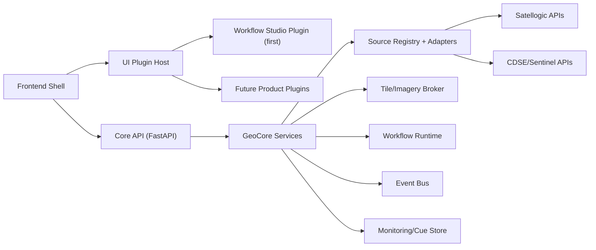

# Image-Mate Extensible Plugin Platform Concept

## 1. Why this direction
You already have the right primitives for a plugin platform:
- multi-source ingest and normalization (`SourceManager`, `satellogic_client`, `merlin_sentinel2_client`)
- workflow orchestration and node graph execution (`GeoWorkbenchEngine`)
- monitoring/cue persistence (`MonitoringStore`)
- frontend workflow builder UI and workbench tabs

The concept below formalizes those primitives into a stable core + plugin model so new product prototypes can be added without rewriting the platform.

## 2. Product goal
Build an easy-to-use but highly flexible extension framework where:
- the **core platform** handles Sentinel/Satellogic archive, display, animation, tasking, and tile APIs
- **plugins** add product-specific workflows, UX, and analytics
- the first formal plugin is the existing workflow editor ("Workflow Studio")

## 3. Architecture overview



## 4. Core vs plugin boundaries

### 4.1 Core platform ("GeoCore")
Core should own:
- canonical scene/event/task models
- source auth/token handling
- source adapter registry
- tile and asset download/proxy services
- workflow execution engine, schedules, subscriptions
- event store and cue/task queue
- plugin loading, validation, lifecycle

Core should not own:
- domain-specific UI logic
- domain-specific analytics models
- custom report templates for every vertical

### 4.2 Plugin responsibilities
Plugins can contribute:
- UI panels/tabs/routes
- workflow node types and validators
- analytics providers
- source adapters (if needed)
- cue policy packs
- export/report packs

## 5. Plugin types
Use small focused plugin types instead of one monolith:
- `ui.panel`: frontend surface (tab, panel, popup, inspector)
- `workflow.node_pack`: nodes/operators for workflow graphs
- `analytics.provider`: model/provider runtime for detections
- `source.adapter`: new imagery/tasking provider implementation
- `policy.pack`: event-to-cue rules and thresholds
- `export.pack`: report/doc/artifact templates

## 6. Backend plugin contract

Define a minimal manifest + runtime interface.

```python
# backend/app/plugins/contracts.py
from dataclasses import dataclass
from typing import Any, Protocol

@dataclass
class PluginManifest:
    plugin_id: str
    name: str
    version: str
    api_version: str
    plugin_type: str
    capabilities: list[str]
    requires: list[str]

class BackendPlugin(Protocol):
    manifest: PluginManifest
    def register(self, registry: "PluginRegistry") -> None: ...
    def start(self) -> None: ...
    def stop(self) -> None: ...
```

Registry responsibilities:
- discover plugins from configured paths
- validate manifest compatibility (`api_version`, `requires`)
- register capabilities (workflow nodes, providers, sources, policies)
- expose `/api/plugins` and `/api/plugins/{id}/health`

## 7. Frontend plugin host contract

Frontend shell loads plugin descriptors and mounts panels:

```ts
// frontend/pluginHost.ts (concept)
export interface UiPlugin {
  pluginId: string;
  title: string;
  mount(el: HTMLElement, ctx: PluginContext): void;
  unmount?(): void;
}
```

`PluginContext` should expose:
- typed API client
- map context (AOI, selected scenes, source/layer state)
- workbench context (runs/schedules/events)
- capability checks

## 8. Core domain model (stable contracts)
Keep these contracts stable and versioned so plugins can rely on them:
- `Scene` (canonical imagery item across sources)
- `SceneAsset` (thumbnail/preview/visual/analytic)
- `MonitoringSubscription`
- `MonitoringEvent`
- `CueTask`
- `WorkflowDefinition` + DAG node schema
- `RunArtifact` + provenance schema

This is already close to existing models and just needs explicit versioning.

## 9. First plugin: Workflow Studio

Promote existing workflow builder into a first-class plugin.

### 9.1 Scope
- visual DAG editor
- node library from runtime registry (not hardcoded)
- workflow validation feedback (required inputs, cycles, missing capabilities)
- run/schedule launchers
- run artifact preview/download

### 9.2 Backend support changes
- add `NodeHandlerRegistry` in `GeoWorkbenchEngine`
- replace `_execute_skill_node` `if/elif` chain with handler lookup:
  - built-ins are registered as built-in plugin pack
  - external plugins can register additional node handlers
- expose `/api/workbench/node-types` with schemas and UI hints

### 9.3 Frontend support changes
- load node types dynamically instead of fixed skill assumptions
- render per-node configuration schema
- keep current UX but drive options from plugin registry

## 10. Sentinel/Satellogic foundation as shared platform services
Make these shared and reusable for all plugins:
- source discovery/search (`SourceManager`)
- normalized item fetch and asset resolution
- WMTS/tile overlay orchestration
- animation/render export utilities
- monitoring and cue persistence
- tasking API bridge

Plugins should call these services through stable APIs, not direct provider clients.

## 11. Suggested package layout

```text
backend/app/
  core/
    models/
    services/
  plugins/
    contracts.py
    registry.py
    loader.py
    builtins/
      workflow_nodes/
      workflow_studio_backend/
      sentinel_layers/
  sources/
    satellogic/
    merlin_s2/
```

```text
frontend/
  shell/
    plugin-host.js
  plugins/
    workflow-studio/
    sentinel-layers/
```

## 12. Delivery plan

### Phase 1 (low risk, fast value)
- define plugin manifest + registry
- register existing built-ins as internal plugins
- add plugin introspection API

### Phase 2
- refactor workflow runtime node execution to registry-based handlers
- migrate existing workflow builder to dynamic node catalog

### Phase 3
- add plugin packaging/discovery path
- add plugin capability permissions and compatibility checks

### Phase 4
- deliver first external plugin prototype:
  - example: "Change Detection Pack" or "Tasking Assistant"

## 13. Guardrails
- keep plugin API small and versioned
- no direct DB writes from plugins; route through service interfaces
- enforce timeouts and resource limits per plugin execution
- isolate plugin errors from core runtime
- emit per-plugin observability metrics (latency, errors, run counts)

## 14. Immediate next implementation tasks
1. Add `PluginManifest` + `PluginRegistry` module.
2. Add `/api/plugins` endpoint.
3. Introduce `NodeHandlerRegistry` in `GeoWorkbenchEngine`.
4. Register current built-in skills as internal node handlers.
5. Move workflow builder UI to consume dynamic node metadata.
