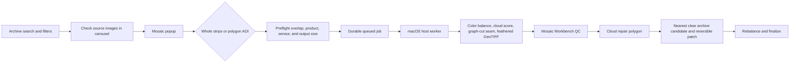

# Mosaic Workbench — implementation plan and status

## Product decision

Mosaicking belongs in a dedicated workbench, while image selection remains in the archive carousel. This keeps archive browsing fast and makes the expensive, multi-image operation explicit.

The operator workflow is:

## Current slice

Implemented in the web application:

- NewSat carousel previews resolve by item identity through `/api/archive/preview`. The browser no longer receives a provider URL for the thumbnail, and the exact catalog S3 host is allowlisted by default.
- Explore, Model Lab, and Mosaic share the same checkbox selection model. Card clicks focus an image; checkboxes control the source stack.
- Search and mosaic controls carry `sensor_generation` with stable values `mark-iv`, `mark-v`, and `unknown`.
- Explicit provider metadata or a configured satellite mapping is required to classify a Mark IV/Mark V sensor. GSD is not used as a proxy for generation.
- `POST /api/mosaics/preflight` validates NewSat visual inputs, a single connected overlap graph, polygon intersection, sensor compatibility, nominal/measured resolution, and an output pixel budget.
- `POST /api/mosaics/jobs` persists a queued job in `mosaic.sqlite3`.
- A host worker contract is available through claim, progress, identity-based input, artifact, cancel, and finalize routes.
- `backend/scripts/mosaic_worker.py` invokes the existing vendored mosaicker on the host. It uses EPSG:3857 for meter-based output resolution and clips polygon jobs before the mosaicking pass.
- Cloud Edit captures a polygon and writes a queued, reversible repair request. The worker-side clear-observation search and pixel replacement are intentionally not presented as complete yet.

## Quality and provenance rules

1. A mosaic source stack must contain at least two valid images.
2. Every selected footprint must belong to one connected overlap component. A chain is valid; isolated groups are not.
3. The first release supports NewSat visual assets from one source and one collection/product profile. L1B, L1D, and L1D-SR should be separate profiles in the UI because their native grids differ.
4. Sensor generation is a compatibility and radiometry warning, not a value inferred from resolution. Unknown generation remains visible to the operator.
5. Whole-strip mode is bounded by output pixels and warns when a polygon is safer. Polygon mode clips source rasters before the host engine runs.
6. The mosaicker uses real source pixels, explicit cloud masks when available, automatic cloud scoring otherwise, global gain/offset balancing, graph-cut seam ownership, and feathering. No synthetic cloud fill is allowed.
7. Cloud repair must retain the original mosaic, repair polygon, source item, source asset, color transform, and operator action as separate provenance records.

## Host/standalone boundary

The FastAPI service is the stable API boundary for standalone use, Hermes calls, and the local UI. It owns provider authentication, archive item resolution, job persistence, and safe artifact routing. The host worker owns raster libraries and long-running computation. This lets a standalone laptop run both processes locally and lets Hermes submit work to a host-exposed API without putting Metal/CoreML or GDAL into the Hermes container.

The worker is currently CPU/GDAL-backed through the existing mosaicker. The next acceleration step is an explicit backend capability and engine adapter for Apple Silicon; it should report the actual provider rather than label a CPU run as GPU-accelerated.

## Next implementation phases

### Phase 1 — complete the current worker path

- Add worker health/capability reporting and a single-job lease timeout.
- Add artifact metadata for CRS, resolution, bands, cloud fraction, seam method, and source provenance.
- Add a map overlay for the completed GeoTIFF and a download link from the QC panel.

### Phase 2 — cloud repair execution

- Search archive candidates covering the repair polygon, prioritizing same sensor generation, same product profile, low cloud cover, and nearest recent capture.
- Present candidate provenance for operator confirmation before pixels are changed.
- Clip the selected candidate to the repair polygon, color-match it against clear neighboring mosaic pixels, blend it into a new mosaic version, and retain a before/after diff.
- Make repairs idempotent and reversible; never overwrite the source mosaic.

### Phase 3 — model and analytics workbench

- Reuse the same archive selection and host-worker boundary for L1B Visual and L1D-SR Visual detection profiles.
- Add model catalog/versioning, class schema editing, scene-separated validation, candidate chips, manual polygons, Luna evidence, and human confirmation gates.
- Keep model provenance attached to every detection and report so an intelligence workflow can distinguish a baseline model, a fine-tuned version, and human-reviewed evidence.

## Acceptance criteria

- A user can search, filter Mark IV/Mark V imagery, check two overlapping images, run a polygon mosaic, see progress, open the resulting artifact, and finalize it without exposing provider credentials or signed URLs to the browser.
- A disconnected selection fails before any download.
- A polygon outside the selected footprint fails before any download.
- A worker crash leaves a failed/retryable job record rather than a silent UI spinner.
- A cloud repair can be audited from the final product back to the repair polygon, source capture, source asset, and operator confirmation.
